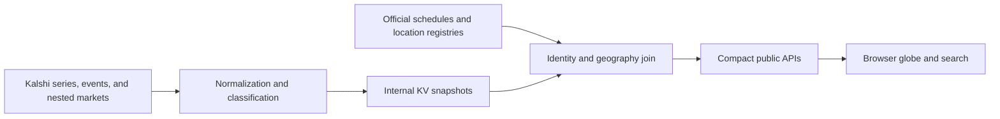

# Kalshi API field notes: quirks, heuristics, and hard-won integration rules

Last updated: 2026-08-02
Project: Market Atlas

## Why this document exists

This is the accumulated engineering model behind the globe's Kalshi integration. It is intentionally more opinionated than an endpoint reference. It records:

- What the official API guarantees.
- What the project has actually observed in live payloads and working Kalshi web pages.
- Which relationships are inferred because the API does not expose them directly.
- Which inferences are safe enough to automate and which need validation or manual overrides.
- How the current polling, caching, normalization, search, and geographic mapping layers work.
- What Kalshi could expose to make this kind of application simpler and less error-prone.
- What this project should improve before it becomes a larger production system.

The most important distinction in this document is between **documented**, **observed**, and **inferred** behavior. Kalshi itself warns that ticker strings have exceptions and should not be treated as a formal relational schema. This project sometimes parses tickers anyway, because participant identity and website paths are otherwise unavailable. Every such parser should therefore be treated as a monitored compatibility layer, not timeless truth.

## Executive summary

Kalshi's internal model is consistent when viewed as an exchange:

1. A **category** groups series for discovery.
2. A **series** is a recurring market template.
3. An **event** groups one or more related binary markets.
4. A **market** is one tradable yes/no contract.

The friction begins when a consumer application wants a different model:

- A sports user thinks in games, teams, leagues, stadiums, and schedules.
- A politics user thinks in elections, candidates, parties, districts, and capitals.
- A weather user thinks in cities, regions, dates, and measurements.
- A map needs coordinates.
- A browser needs a canonical website URL.
- Search needs normal names and aliases, not exchange shorthand.

Those consumer-facing entities are only partially represented in Kalshi's API. The globe therefore uses Kalshi as the authority for **listed contracts, prices, volume, status, and tickers**, while using separate schedules and registries as the authority for **location, venue, normal display names, and geographic meaning**.

The integration's core rule is:

> Never invent a posted Kalshi market from a schedule, and never expect a Kalshi market to contain enough information to build a geographic schedule by itself.

The current architecture reflects that rule:



## The object model, translated into product language

The official glossary says that an event is the basic unit members should interact with, while a market is a single binary contract. That distinction matters.

### A two-team game

A game such as Boston versus the Los Angeles Dodgers is one event with two binary markets:

```text
Series: KXMLBGAME
Event:  KXMLBGAME-26AUG021920BOSLAD
Market: KXMLBGAME-26AUG021920BOSLAD-BOS
Market: KXMLBGAME-26AUG021920BOSLAD-LAD
```

The event is the matchup. Each nested market is the proposition that one team wins. This means a consumer-facing matchup card should operate at event level but show market-level prices.

### A championship future

A championship future is also one event with many binary markets:

```text
Series: KXMLB
Event:  KXMLB-26
Market: KXMLB-26-LAD
Market: KXMLB-26-BOS
...
```

The event title can be generic, such as `Pro Baseball Champion`. The team identity, price, and volume live on each nested market. Caching the event once and reusing one price for every team is a serious data-integrity bug. Each team must resolve to its own market ticker.

### A threshold family

Season wins and player props are different again. One event can contain a ladder of binary thresholds:

```text
Series: KXMLBWINS-LAD
Event:  KXMLBWINS-LAD-26
Market: KXMLBWINS-LAD-26-T100   # 100+ wins

Series: KXMLBKS
Event:  KXMLBKS-26AUG021920BOSLAD
Market: ...-LADPITCHER-7        # a pitcher reaches 7+ strikeouts
```

These are not mutually exclusive choices in the same sense as a game winner. Several thresholds can simultaneously resolve yes. The UI must not normalize their prices to sum to 100%.

## What we consider authoritative

| Concern | Authority | Why |
| --- | --- | --- |
| Whether a contract exists | Kalshi event/market payload | A schedule cannot prove listing. |
| Current displayed price | Kalshi market fields | The exchange is the price source. |
| Market and event ticker | Kalshi payload | Never present a series ticker as a specific event ticker. |
| Market status | Event plus all nested market statuses | Event-level status alone is insufficient for outrights. |
| Event date and time | Official sports schedule first; Kalshi occurrence/expiration for refresh cadence | Kalshi timing can represent expiration or a tournament final rather than the consumer-visible start. |
| Venue and coordinates | Official schedule or maintained geography registry | Kalshi events generally do not expose usable venue coordinates. |
| Team display name and aliases | League/team registry | Kalshi often abbreviates labels. |
| Political party | Structured label/ticker evidence, then maintained candidate map | Party is not consistently exposed as a first-class field. |
| Canonical Kalshi website link | Verified special-case resolver or ticker fallback | The API does not expose one universally reliable page URL. |

## Acquisition strategy

### Prefer events with nested markets

The sports pipeline discovers events with:

```text
GET /events?status=open&series_ticker=...&with_nested_markets=true&limit=200
```

This is better than reconstructing an event from a flat `/markets` response because it preserves the parent event, all outcomes, event metadata, and exact tickers in one call. An individual known event is refreshed with:

```text
GET /events/{event_ticker}?with_nested_markets=true
```

That one request updates every outcome in the matchup or outright.

The official API caps event pages at 200 and returns a cursor. The cursor is opaque and must be replayed until empty. It is not an offset and should not be manipulated.

### Series discovery is useful but not sufficient

`GET /series` can filter by category and tags and can include series volume. The project uses that for:

- Sports futures discovery.
- The `Politics` + `International` series set.
- The exact `Climate and Weather` category.

The awkward part is that event discovery does not provide the same category/tag filtering surface. For politics, weather, and the generalized futures pass, the project pages through all open events and joins them back to the previously discovered series set by `series_ticker`.

That works, but it is expensive and creates a completeness dependency between two endpoints. A category-filtered events endpoint, or a batch of series tickers on `/events`, would remove much of this cost.

### Discovery and refresh are different operations

Discovery finds newly listed events. Refresh updates known events. They have different optimal cadences:

- Sports discovery: hourly.
- Known distant sports event: hourly.
- Within 24 hours: every 15 minutes.
- Within two hours: every five minutes.
- Live through expected expiration: every minute.
- Team futures discovery and rebuild: daily.
- Weather: frequency-aware, from every minute for hourly series to every 15 minutes for longer horizons.
- Politics: hourly at long range, then 15 minutes, five minutes, and one minute near the relevant close.

The minute cron is only a scheduler. It does not imply that every upstream object is fetched every minute.

## Authentication and rate limits

Public market data works without credentials. Authenticated requests use three headers:

- `KALSHI-ACCESS-KEY`
- `KALSHI-ACCESS-TIMESTAMP`
- `KALSHI-ACCESS-SIGNATURE`

The signature is RSA-PSS/SHA-256 over:

```text
timestamp + uppercase HTTP method + full URL pathname
```

The query string is deliberately excluded. The current worker correctly builds the full request URL and signs `new URL(url).pathname`, which includes `/trade-api/v2/...` but not query parameters.

Kalshi's limits are token based, not simple requests per second. Most endpoints cost 10 tokens unless the endpoint-cost API says otherwise. An authenticated account can inspect its read refill rate and bucket capacity at `/account/limits`.

Important behavior:

- Read and write use separate buckets.
- Buckets refill continuously rather than resetting in fixed windows.
- Some tiers can accumulate a short burst capacity.
- `429` currently does not include `Retry-After` or `X-RateLimit-*` headers.
- Batch requests do not necessarily save tokens because each item can still be billed.

The current sports poller uses 25% of an authenticated read refill rate by default, caps itself at 10 requests per second, and uses a conservative unauthenticated rate otherwise. Requests are evenly spaced. `429` and `5xx` responses retry up to four times with jittered exponential backoff.

### Current rate-limit weakness

Each pipeline creates its own rate gate. Production cron runs sports, politics, weather, and futures sequentially, which prevents literal concurrency, but a fresh gate begins with no memory of tokens consumed by the prior pipeline. Local endpoints can also start separate background polls. A production-grade version should use one process-wide or durable token coordinator across all Kalshi work, with reserved priority lanes:

1. Live games.
2. Pregame games.
3. Near-term weather and elections.
4. Baseline discovery.
5. Daily futures maintenance.

That would make the configured budget fraction an aggregate guarantee rather than a per-pipeline aspiration.

## Numeric fields: fixed point is now the real format

Kalshi's 2026 fixed-point migration matters throughout the project.

- Price fields such as `last_price_dollars`, `yes_bid_dollars`, and `yes_ask_dollars` are decimal strings in dollars, potentially with sub-cent precision.
- Quantity fields such as `volume_fp` and `open_interest_fp` are fixed-point strings and can represent fractional contracts.
- Legacy integer fields should be treated only as compatibility fallbacks.

The normalization layer converts dollar strings to cents without rounding:

```text
"0.6350" dollars -> 63.5 cents
```

That decimal must survive caching and sorting. A blanket `Math.round()` would destroy legitimate subpenny prices, especially near 0% and 100% where Kalshi supports finer ticks.

The current field priority is:

1. `*_dollars` for prices.
2. Legacy integer price only if the dollar field is absent.
3. `volume_fp` and `open_interest_fp` before legacy quantities.

### Price is not a normalized sportsbook line

Each market is a binary yes/no contract. The yes price is often interpreted as an implied probability, but several caveats matter:

- The last trade may be stale.
- The best bid and ask describe the current executable range, not one exact probability.
- When the last trade is missing, this project falls back to the bid/ask midpoint, then to whichever side exists.
- In a multi-outcome event, last prices for all candidates or teams need not sum to 100 at a single moment.
- Threshold markets overlap and must not be normalized together.

The UI should label the source honestly: `last trade`, `mid`, `bid`, or `ask`. Calling every number simply “odds” hides important liquidity information.

## Time fields are semantically inconsistent for product use

Potential start fields include:

- `occurrence_datetime`
- `strike_date`
- `expected_expiration_time`
- `close_time`

Potential end fields include:

- `latest_expiration_time`
- `expected_expiration_time`
- `expiration_time`
- `close_time`

The normalizer prefers the earliest valid occurrence time as the start. If no occurrence exists, it falls back through strike and expiration-like fields. It uses the latest valid expiration-like time as the end.

This is good enough for polling, but not always for scheduling:

- A tennis outright may use the tournament final or expiration as its important time, even though the tournament should be visible all week.
- Golf, cricket, and racing can span multiple days.
- A game ticker may encode a scheduled time that later changes.
- Close time is a trading lifecycle field, not necessarily the public event's start.

For this reason, the map's official schedules determine when and where sports events are displayed. Kalshi times determine how aggressively their markets should be refreshed and whether they overlap the browser's near-term cache window.

The app always retains open ATP/WTA outrights in the compact response so the schedule join can place them across the tournament window instead of losing them before the final.

## Status vocabulary is not uniform

The events list filter documents values such as `unopened`, `open`, `closed`, and `settled`. Market payloads and the changelog also use values such as:

- `active`
- `inactive`
- `paused`
- `determined`
- `finalized`
- `disputed`
- `amended`

Consumer code should not assume that one enum applies to every object or endpoint.

The normalizer handles an especially important outright case: eliminated player markets may finalize one by one while other nested contracts remain active. If any nested market is `active` or `open`, the normalized event remains active even if the event or first nested market looks terminal.

The project treats `closed`, `settled`, `finalized`, `determined`, and `resolved` as completed display states. This is deliberately broader than any one endpoint's documented enum.

## Tickers: extremely useful, not a guaranteed grammar

The official documentation explicitly says there are ticker exceptions and recommends relying on explicit relationship fields instead of parsing strings. That is the right default.

Still, tickers carry information the API does not expose elsewhere, so this project uses them under controlled conditions.

### Safe uses

- Exact equality with a ticker returned by Kalshi.
- Joining a market to its explicit `event_ticker`.
- Joining an event to its explicit `series_ticker`.
- Matching a nested team future by an exact final ticker segment when the relevant series has been verified.
- Using an expected schedule-derived ticker only as a candidate that must be confirmed against cached Kalshi events.

### Risky uses

- Splitting the first hyphen and assuming it always recovers the series.
- Parsing dates, times, or team codes without confirming the series convention.
- Treating a bare series ticker such as `KXNFLGAME` as a posted event.
- Inferring a team from a two-letter substring anywhere in a ticker.
- Constructing a website path from ticker parts.

### Current pragmatic uses

Sports game tickers frequently encode date, time, and team codes. This helps match schedule records after normal name matching. MLB player props reuse the game suffix across `KXMLBGAME`, `KXMLBKS`, and `KXMLBHRR`, which makes game-scoped prop lookup possible.

Those rules are regression-tested per series. A newly added league should not reuse an existing ticker parser until live examples prove the convention.

## Names and nicknames: the API's most visible consumer mismatch

Kalshi often shortens team labels to distinguish multiple teams from the same city:

| Live label observed | Consumer name |
| --- | --- |
| `Los Angeles D` | Los Angeles Dodgers |
| `Los Angeles A` | Los Angeles Angels |
| `New York Y` | New York Yankees |
| `New York M` | New York Mets |
| `Chicago C` | Chicago Cubs |
| `Chicago WS` | Chicago White Sox |
| `A's` | Athletics |
| `Boston` | Boston Red Sox in an MLB market |

The same pattern appears in shared futures for other leagues, such as `Los Angeles R`, `Los Angeles C`, and `Los Angeles L`. A title like `2027 Pro Football Champion` or `2027 Pro Basketball Champion` is exchange-efficient but poor search text for a fan typing “Rams” or “Lakers.”

The search layer therefore enriches cached market text with a league-specific alias registry. For MLB, `Dodgers`, `Los Angeles Dodgers`, `Los Angeles D`, and `LAD` are equivalent search terms after the candidate has been proven to be an MLB market for that team.

The qualification in that last sentence matters. A global string replacement of `Boston` with `Red Sox` would contaminate NBA and NHL results. Aliases are applied only inside the relevant sport/series context.

### Current alias technical debt

MLB identity currently exists in both the worker's team-futures registry and the search alias table. That duplication can drift. The next refactor should create one versioned entity registry containing:

- Stable internal entity ID.
- League.
- Current canonical name.
- Kalshi participant codes.
- Schedule-provider codes.
- Historical names and common nicknames.
- City-only or shortened Kalshi labels.
- Valid-from and valid-to dates for renamed or relocated teams.

## Sports event matching

The schedule is loaded first with date, exact UTC start, home venue, city, and coordinates. Kalshi is then attached by descending confidence:

1. Exact already-known event ticker.
2. Verified series plus expected ticker.
3. Verified series plus both team identities and compatible event time.
4. No match.

For international baseball, the fallback requires both teams and rejects events whose times differ by more than two hours. This is intentionally conservative; a wrong market is worse than a temporarily unpriced schedule marker.

Near-term completeness is enforced separately. Any unelapsed schedule event overlapping today or tomorrow must resolve to a real Kalshi event. Distant schedule entries may remain unlisted. This catches silent failures when:

- Kalshi introduces a new series ticker.
- Team abbreviations change.
- A market is posted under a different event time.
- Pagination or discovery fails.
- A new league was added to the schedule but not to Kalshi discovery.

## Futures: why team purity must be a hard invariant

Team futures exposed the most dangerous class of bug in this project: treating one shared event as if it contained one shared price.

For `KXMLB-26`, the event is “Pro Baseball Champion.” Each team has its own nested binary market. The correct Dodgers card is `KXMLB-26-LAD`; the correct Boston card is `KXMLB-26-BOS`. Event-level volume can be shared for ranking, but price, bid, ask, and market volume must come from the selected team's market.

The MLB cache now writes one versioned record per team:

```text
kalshi:team-futures:v2:MLB:LAD
kalshi:team-futures:v2:MLB:BOS
...
```

Every card carries `sport`, `teamCode`, `marketKind`, `seriesTicker`, `eventTicker`, and exact market `ticker`. Records are validated before writing and again before serving. Tests deliberately create mislabeled data where the LAD ticker carries a Boston label; exact ticker identity wins over the misleading label.

### MLB future shapes

- Title: one shared event, one market per team.
- Playoffs: one shared event, one market per team.
- Division: one shared division event, one market per team.
- Regular-season wins: a team-specific series and event with several thresholds.

For regular-season wins, the app chooses the team's highest-volume threshold. That is a product choice, not a claim that this threshold is mathematically special.

The generalized futures pipeline discovers categories such as title, conference, division, playoffs, win total, seed, finalist, advance, top-two/four/eight/half, relegation, cup, best record, and worst record. It explicitly rejects likely false positives such as:

- Individual games.
- Spreads and totals.
- Player markets.
- Awards and MVP.
- Draft markets.
- Exact score, halves, quarters, and prop-like contracts.
- Novelty markets with sports words in the title.

Because title classification is text-driven, the pipeline combines live series discovery with a verified fallback descriptor set. The fallback prevents an empty futures UI if series metadata discovery temporarily fails; it must be reviewed as leagues and naming conventions evolve.

### Atomicity and leases

Daily futures maintenance uses a KV lease (`pollStartedAt`) to prevent overlapping work. The generic and MLB futures builds share one paginated open-events sweep. A failed rebuild preserves the prior successful manifest instead of replacing it with a partial one.

This pattern should be used for all slow classification pipelines: build a complete candidate snapshot, validate it, then publish atomically.

## Player props are game-scoped, not team-future data

MLB player props currently come from:

- `KXMLBKS`: strikeout thresholds.
- `KXMLBHRR`: hits + runs + RBIs thresholds.

The visible market label usually contains only the player and threshold. It often does not name the player's team. To avoid showing every game's props under every team, lookup requires:

1. The selected game event ticker.
2. The corresponding prop event suffix.
3. The selected team code in the prop market's ticker structure when available.

This is another controlled ticker dependency. It works for the verified MLB prop series, but it should not become a generic “find team code anywhere” rule.

Player props also demonstrate why one event can contain many individually useful market windows. A single HRR event can contain dozens of players times several thresholds. Combined event volume is not a useful preview of one contract; the UI should expose the individual market label, price, and volume.

## Politics: the API supplies contracts, not a political map

Politics requires three separate enrichment layers:

1. **Election classification**: national, statewide, congressional district, primary, or international.
2. **Geography**: capital or district point.
3. **Party identity**: Republican, Democratic, or neutral/unknown.

### Geographic classification

US statewide markets are recognized from strict titles such as `Massachusetts Senate winner?` and mapped to a maintained state-capital registry. House races are recognized from several live and legacy ticker/title forms and mapped to Census district points.

International politics is discovered through `category=Politics&tags=International`, but many event titles do not resolve to one obvious country. The maintained manual series mappings are:

| Series | Map location or locations | Geographic interpretation |
| --- | --- | --- |
| `KXNOBELPEACE` | Oslo | The award institution, not the nationality of a nominee. |
| `KXEUEXIT` | Brussels | EU institutional center. |
| `KXEUEXPANSION` | Brussels | EU institutional center. |
| `KXEUEXITCOUNTRY` | Brussels | EU institutional center rather than whichever country appears in a nested outcome. |
| `KXTARIFFRATEEU` | Brussels | EU policy authority. |
| `KXLEAVEOPEC` | Vienna | OPEC headquarters. |
| `KXUKRENEWOB` | London | UK political market. |
| `KXELONMARS` | Austin | Maintained product choice for the person-centered market; this is not geography supplied by Kalshi. |
| `KXBRICS` | Shanghai | Maintained product choice for the BRICS market. |
| `KXSUPERBOWLWHITEHOUSE` | Washington, D.C. | White House event. |
| `KXTRUMPMOJTABA` | Tehran | Iran-centered geopolitical market. |
| `KXNORDSTREAM2` | Lubmin, Germany | Pipeline endpoint rather than a national capital. |
| `KXNETANYAHUPARDON` | Tel Aviv | Israel-centered political market. |
| `KXBURNHAMOUT` | London | UK political market. |
| `KXPOPEVISIT` | Vatican City | Papal market. |
| `KXZELENSKYPUTIN` | Moscow and Kyiv | Deliberately duplicated because both leaders and capitals are intrinsic to the event. |
| `KXABRAHAMSA` | Tel Aviv and Riyadh | Deliberately duplicated bilateral event. |
| `KXABRAHAMQ` | Tel Aviv and Doha | Deliberately duplicated bilateral event. |
| `KXG7LEADEROUT` | Ottawa, Paris, Berlin, Rome, Tokyo, London, and Washington | One marker at every G7 national capital. |

`KXLEADERSOUT` is dynamic rather than fixed: its nested candidate markets are ranked by price, then the five highest-probability recognized leaders are mapped to their capitals. That means one Kalshi event can intentionally appear at several map locations.

These mappings are presentation policy, not exchange facts. They need provenance and a review date because the most intuitive point can change, and some choices—especially person-centered or multinational questions—are inherently editorial.

The state/public cache retains an `unmapped` list sorted by volume. This is essential operationally: geography failures should become a queue for review, not silently disappear.

### Party inference

Party is inferred in this order:

1. Explicit party words in the label.
2. A terminal `-D` or `-R` ticker segment.
3. A maintained candidate-to-party table.
4. Neutral/unknown.

Candidate mapping is unavoidable for clean red/blue presentation, but it ages quickly. It should be versioned by election cycle and backed by provenance rather than expanded indefinitely as a flat constant.

### House races and inconsistent series shapes

House markets have appeared in several structures:

- Shared series: `KXHOUSERACE`, event such as `KXHOUSERACE-PA15-26`.
- Legacy district series: `HOUSECA3`, event `HOUSECA3-26`.
- Legacy `KXHOUSE...` variants.
- California umbrella events such as `KXCAELECTION-2604`.
- Candidate-specific pages such as `KXCA11PERSON-26`.

The classifier supports all of these only when the state/district and 2026 cycle can be validated. A similarly shaped ticker is not automatically a House race.

## Weather: multi-city events are the critical edge case

Weather series are discovered from the exact `Climate and Weather` category. Series metadata provides useful frequency and tags, but geography is still inferred from text.

The location registry includes city names, common abbreviations, regional basins, and special geographic concepts such as the Atlantic basin, Arctic, El Niño region, and Lake Mead. Philadelphia had to be added explicitly because completeness cannot be inferred from the category alone.

### One event can contain one market per city

A rain event can be titled broadly while each nested binary market represents a different city. Treating the event as one geographic point selects whichever city happens to match first and produces the wrong detail panel.

The weather builder therefore follows this logic:

1. If the event text resolves to exactly one location, keep the event together.
2. Otherwise inspect every nested market label/title.
3. Split each matched binary market into a location-specific map record.
4. Derive the complementary `No` price as `100 - Yes` only for a single binary contract.
5. Use `bundleId` as the primary selection key in the UI, because several locations can share the same event ticker.

This last point fixed a concrete bug where selecting “rain in Boston” opened Los Angeles: the two location records shared one event ticker, and the UI selected the first event match instead of the exact Boston bundle.

### Frequency-aware polling

Weather uses `series.frequency` when present:

- Hourly: one minute.
- Daily: two minutes.
- Weekly/monthly/custom: 15 minutes.
- Unknown/long range: hourly.
- Any market within six hours of its end: one minute.

This is more efficient than treating a seasonal hurricane market like today's temperature.

## Canonical Kalshi website URLs are not derivable reliably

This is one of the most frustrating integration gaps.

The website commonly uses:

```text
/markets/{series-slug}/{human-slug}/{event-ticker}
```

But the API does not return the canonical human slug for every event, and the path shape is inconsistent enough that a generic slug function cannot be trusted.

Observed working examples:

```text
https://kalshi.com/markets/kxhouserace/house-race-winner/kxhouserace-pa15-26
https://kalshi.com/markets/houseca3/house-ca3/houseca3-26
https://kalshi.com/markets/kxcaelection/california-general-elections-/kxcaelection-2604
```

Notice the differences:

- `KXHOUSERACE` is a shared series, while `HOUSECA3` is district-specific.
- One slug is a generic market family, another is derived from a district.
- The California elections slug includes a trailing hyphen.
- Some Senate primary pages work with only series and ticker path segments.

The current resolver uses verified special cases for House, California, and Senate-primary structures, then falls back to:

```text
https://kalshi.com/markets_by_ticker/{ticker}
```

The ticker route is less elegant but safer than manufacturing a broken slug. Search results also use it when no known canonical route exists.

### Recommended URL policy

1. Prefer a URL returned by Kalshi if one becomes available.
2. Use a verified path template only for a tested series family.
3. Cache successful canonical redirects if link validation is available server-side.
4. Fall back to `markets_by_ticker`.
5. Never claim a guessed slug is canonical without testing it.

## Search requires a semantic layer above Kalshi

The integrated search indexes cached sports, politics, weather, and futures records. It does not call Kalshi per keystroke.

It understands:

- Category intent: sports, politics, or weather.
- Sport and league aliases.
- Time language such as today, tonight, tomorrow, weekend, and next week.
- Ranking language such as biggest, highest volume, closest, and soonest.
- Cities and geographic aliases.
- Team nicknames that are missing from live labels.

Search routing rules are deliberately explicit:

- `Boston` means center the active globe on Boston, with matching markets below it.
- `Boston sports` means switch to Sports and center Boston.
- `Boston Red Sox` means select the matching sports event before offering a generic location.
- `rain in Boston` means switch to Weather and select the Boston rain market.
- `Massachusetts Senate` means switch to Politics and open the matching election.

One-letter prefix matching is prohibited. It previously allowed a location abbreviation such as `D` from `Washington, D.C.` to pollute a search for `Dodgers`. Prefix matching now requires meaningful token lengths, and MLB search text is enriched only after series-aware team identification.

The search cache key includes the active category because the same plain location query should stay on the user's current globe.

## Cache architecture

Browsers never call Kalshi directly. This is important for credentials, rate limits, latency, resilience, and consistent data semantics.

### Internal versus public cache

The worker stores stateful internal records and sanitized public records separately:

```text
kalshi:sports:state:v2
kalshi:sports:public:v2
kalshi:politics:state:v1
kalshi:politics:public:v1
kalshi:weather:state:v1
kalshi:weather:public:v1
kalshi:team-futures:manifest:v3
kalshi:team-futures:v2:{SPORT}:{TEAM}
```

Internal state keeps discovery timestamps, refresh timestamps, errors, and source snapshots. Public records contain only normalized fields needed by the browser.

### Browser and edge caching

- `/api/odds` filters to a roughly 48-hour schedule-join window.
- Responses use ETags and short edge TTLs with stale-while-revalidate.
- Politics, weather, search, and team futures have separate TTLs appropriate to their volatility.
- The browser polls only the compact cache endpoint every 30 seconds.
- Team-future clicks use a one-minute browser cache and never cause direct upstream work.
- The local server persists the KV mirror to `.local-cache/kalshi-kv.json`, so restarts do not create an empty UI or unnecessary cold-discovery storm.

### Staleness policy

The API removes an event if its snapshot is older than three adaptive refresh intervals, with a five-minute minimum. It reports an updating state and stale counts rather than silently showing embedded or old odds.

This is intentionally strict. A temporarily blank price with a clear warming state is preferable to a confident-looking stale price.

### Page traffic is decoupled from upstream traffic

Ten users and 100,000 users should produce the same scheduled Kalshi request load. Edge and KV reads scale with audience; upstream polling scales with markets and desired freshness.

## Known failure modes and the defenses we added

| Failure mode | Consequence | Defense |
| --- | --- | --- |
| Series ticker displayed as event ticker | Link appears specific but does not represent a posted event | Require exact Kalshi event ticker before marking posted. |
| Shared futures event cached as one team price | Every team shows identical odds | Per-team exact market ticker, versioned records, purity validation. |
| First nested market controls event status | Active outright disappears when one player is eliminated | Event stays active while any nested market is active/open. |
| City-only labels are treated as full team names | “Dodgers” search returns nothing | Series-aware alias expansion. |
| One event ticker reused across city-specific weather records | Wrong city opens | Select exact bundle ID before event ticker. |
| Guessed website slug | Broken Kalshi link | Verified resolver plus ticker fallback. |
| One broad global political title matches several countries | Arbitrary location | Manual multi-location mapping or unmapped queue. |
| Party omitted from outcome metadata | Wrong red/blue styling | Label/ticker/candidate inference with neutral fallback. |
| Tournament expiration treated as display start | Outright vanishes during tournament week | Join to external schedule and retain open ATP/WTA outrights. |
| Live market not refreshed quickly enough | Stale in-game price | Adaptive one-minute live cadence. |
| Schedule event has no posted market | UI implies tradability | Near-term hard coverage error. |
| Partial daily rebuild overwrites good data | Missing futures after transient error | Lease, validate, atomic publish, preserve prior snapshot. |
| Fixed-point strings coerced to integers | Lost subpenny/fractional precision | Parse `_dollars` and `_fp` first, retain decimals. |

## Improvements Kalshi could make upstream

These are the highest-leverage additions for consumer applications.

### 1. Return canonical web URLs

Add `web_url` or `canonical_url` to series, event, and market responses. This would eliminate brittle slug templates and link validation.

### 2. Add structured participants

For sports, expose an array such as:

```json
{
  "participant_id": "mlb:LAD",
  "role": "home",
  "league": "MLB",
  "canonical_name": "Los Angeles Dodgers",
  "short_name": "Dodgers"
}
```

`primary_participant_key` helps when present, but it is not enough to describe both sides of a game or every future.

### 3. Add structured geography

Useful fields would include venue, city, region, country, latitude, longitude, and geographic scope. Non-point events should support multiple locations or a geometry/basin identifier.

### 4. Separate occurrence, trading close, and settlement semantics clearly

Expose explicit `scheduled_start`, `scheduled_end`, `trading_close`, `expected_settlement`, and `display_window` fields. Reusing expiration-like fields forces sport-specific interpretation.

### 5. Normalize lifecycle enums

Use one documented status vocabulary across event and market objects, or provide a normative mapping.

### 6. Expose category/tag filtering on events

Allow category, tags, or multiple `series_ticker` values on `/events`. This would avoid sweeping the entire open-event universe after series discovery.

### 7. Provide a trading-data delta feed

`min_updated_ts` is documented around metadata changes and should not be assumed to capture price movement. A price/volume update cursor or public WebSocket snapshot sequence would greatly reduce REST refreshes.

### 8. Expose stable entities separately from tickers

Tickers are human-readable and useful, but an immutable event ID, participant ID, jurisdiction ID, and election-cycle ID would survive naming and path changes.

### 9. Add structured political metadata

Office, jurisdiction, district, election date, stage, party, candidate ID, and incumbency should be first-class fields rather than title conventions.

### 10. Add explicit grouping for multi-location markets

Weather and geopolitics need a way to say that one event contains one market per city, or that one geopolitical event belongs at multiple locations.

### 11. Return rate-limit response headers

Even with `/account/limits`, `Retry-After` or remaining-token headers on `429` would make backoff more precise.

### 12. Publish an official participant/competition alias registry

Kalshi's concise labels are reasonable inside a trading UI, but API clients need canonical names and common aliases for search.

## Improvements this project should make

### Priority 0: integrity

1. Move all league/team aliases into one versioned entity registry shared by schedules, search, futures, and prop matching.
2. Add a canonical URL resolver service with per-series templates, ticker fallback, validation timestamps, and failure telemetry.
3. Store match provenance and confidence on every joined sports event, political location, and weather bundle.
4. Keep exact per-team and per-market identity checks as non-negotiable response validation.

### Priority 1: efficiency

1. Use one aggregate Kalshi token coordinator across sports, politics, weather, and futures.
2. Precompute a compact search index when public caches are written instead of rebuilding all searchable text on every query.
3. Consider a server-side WebSocket consumer for live markets while retaining REST discovery and reconciliation.
4. Hash normalized events and avoid unnecessary KV writes when nothing changed.
5. Use bounded batch ticker lookups where token cost and endpoint behavior make them genuinely cheaper.

### Priority 2: maintainability

1. Record anonymized live fixtures for every supported series shape.
2. Add contract tests for new event and market status values.
3. Add scheduled link-health checks for canonical Kalshi URLs.
4. Promote `unmapped` politics/weather records into a small admin mapping interface with audit history.
5. Version party and political-leader registries by cycle.
6. Document every ticker parser with example payloads, confidence level, and fallback behavior.

### Priority 3: observability

Track at least:

- Requests and tokens by pipeline and endpoint.
- `429`, `5xx`, retry count, and retry latency.
- Discovery pages and discovered events per series.
- Events due, refreshed, stale, and removed.
- Schedule-to-market match method and confidence.
- Unmapped politics/weather volume.
- Broken canonical links by series.
- Search queries with zero results and alias-assisted matches.
- Team-futures record validation failures.
- Age of newest and oldest public snapshots.

## Checklist for adding a new market family

1. Identify the exact series ticker from live API data.
2. Save at least three representative event payloads, including an edge case.
3. Confirm whether one event contains one market, two team markets, many mutually exclusive candidates, or overlapping thresholds.
4. Verify which time field corresponds to the consumer-visible event.
5. Determine whether location is present, inferable, or external.
6. Confirm all active and terminal status values encountered.
7. Verify fixed-point price and volume fields.
8. Test cursor pagination through the entire series.
9. Test the actual Kalshi website URL; do not assume the slug.
10. Define exact identity rules and a conservative no-match behavior.
11. Add cache cadence and staleness rules proportional to volatility.
12. Add search aliases and category intent.
13. Add regression tests for classification, wrong-match rejection, stale data, and links.
14. Add the family to health metrics and the near-term coverage invariant where applicable.

## Current implementation map

- `src/worker.js`
  - Authentication, rate gates, retries, normalization, discovery, adaptive polling, KV schemas, public APIs, futures, and health.
- `src/market-search.js`
  - Cross-category intent parsing, ranking, aliases, price previews, and location navigation.
- `src/politics-registry.js`
  - Election classification, state capitals, House districts, party inference, international manual mappings, and URL special cases.
- `src/weather-registry.js`
  - Weather geography, event splitting, horizon/kind classification, and weather page URLs.
- `public/index.html` and `public/assets/app.js`
  - The canonical Market Atlas shell, category lifecycle, shared map position, and cross-category navigation.
- `public/categories/`
  - Standalone Sports, Politics, and Weather map sources composed by the canonical shell.
- `public/assets/sports-odds.js`
  - Cache-only browser polling and team-market request validation.
- `test/worker.test.js`
  - Data-integrity, cache, discovery, futures, props, and classification regression tests.
- `test/app-shell.test.js`
  - Cross-tab lifecycle, search, map navigation, responsive behavior, and UI integration tests.

## Official references

- [Kalshi glossary and ticker guidance](https://docs.kalshi.com/getting_started/terms)
- [Get Events](https://docs.kalshi.com/api-reference/events/get-events)
- [Get Event with nested markets](https://docs.kalshi.com/api-reference/events/get-event)
- [Get Markets](https://docs.kalshi.com/api-reference/market/get-markets)
- [Get Market](https://docs.kalshi.com/api-reference/market/get-market)
- [Get Series List](https://docs.kalshi.com/api-reference/market/get-series-list)
- [Cursor pagination](https://docs.kalshi.com/getting_started/pagination)
- [Rate limits and token costs](https://docs.kalshi.com/getting_started/rate_limits)
- [Authenticated-request signing](https://docs.kalshi.com/getting_started/quick_start_authenticated_requests)
- [Account API limits](https://docs.kalshi.com/api-reference/account/get-account-api-limits)
- [Fixed-point migration](https://docs.kalshi.com/getting_started/fixed_point_migration)
- [API changelog](https://docs.kalshi.com/changelog)

## Final operating principles

1. Treat event and market objects as exchange primitives, not ready-made product cards.
2. Use explicit relationship fields first and ticker parsing only inside verified series adapters.
3. Keep geography and normal entity names in versioned registries with provenance.
4. Cache each tradable market's identity and price separately, even when many markets share one event.
5. Never let a transient poll failure replace a complete validated snapshot with partial data.
6. Prefer a visible warming or unmapped state to a confidently wrong price, team, city, party, or link.
7. Make every heuristic observable, testable, and replaceable when Kalshi exposes better structured data.
